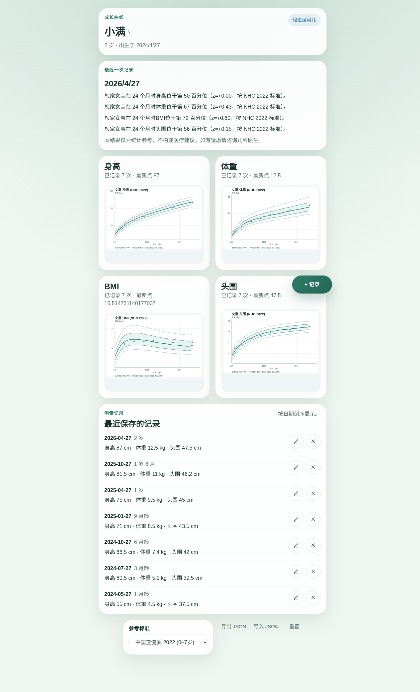
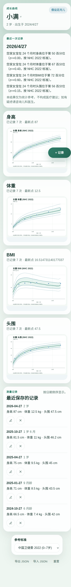

# groowooth

> 开源儿童成长曲线工具——支持 WHO + 中国卫健委标准，自带 AI agent 接入。
> Open-source child growth curve toolkit — WHO + China NHC standards, with native AI agent (MCP) integration.

[](https://github.com/xiaot945/groowooth/actions/workflows/ci.yml) []() []() []()

🚀 **在线试用 / Try it now**：<https://groowooth.pages.dev>

## 是什么

家长用浏览器记录孩子身高/体重/头围，按 **WHO 2006/2007** 或 **中国卫健委 WS/T 423-2022** 标准看百分位曲线。数据本地存（IndexedDB），零账号、零云、零广告。

同时提供 **MCP server**，让 Claude Desktop / Cursor / Cline 等 AI 客户端可以直接调用「评估生长」「画曲线」「解读 z-score」三个工具。

## 截图

<table>
  <tr>
    <td align="center"></td>
    <td align="center"></td>
  </tr>
  <tr>
    <td align="center"><sub>桌面：4 张曲线 + 最近一次记录的统计解读 + 标准切换</sub></td>
    <td align="center"><sub>移动：单列布局，PWA 可安装</sub></td>
  </tr>
</table>

## 三层架构

```
@groowooth/core   纯 TS 计算库 + 标准数据，零 runtime deps（除 zod）
                  WHO 2006/2007 用 LMS Box-Cox；NHC 2022 用 SD 表分段线性内插
       ↑                          ↑
       │                          │
@groowooth/web              @groowooth/mcp
React + Vite                Node + @modelcontextprotocol/sdk
IndexedDB 本地存             stdio transport，3 个 tool
家长用                       AI agent 用
```

## 快速开始

### 先决条件

- Node.js 18+
- pnpm 10+

### 装依赖 + 跑

```bash
pnpm install

# 网页（开发模式，http://localhost:5173）
pnpm dev:web

# 网页（生产构建）
pnpm build:web

# 跑全部测试
pnpm test

# 单独构建核心库
pnpm --filter @groowooth/core build

# 构建 MCP server（产出 packages/mcp/dist/server.js）
pnpm --filter @groowooth/mcp build
```

### 接入 Claude Desktop

构建后在 Claude Desktop 配置文件加：

```json
{
  "mcpServers": {
    "groowooth": {
      "command": "node",
      "args": ["/path/to/groowooth/packages/mcp/dist/server.js"]
    }
  }
}
```

然后在 Claude 里直接说「我家娃 24 个月，身高 86 cm，体重 12 kg，按卫健委标准评估一下」即可。

## 核心 API

所有标准数据都是按需懒加载的。自 `v0.1.0` 起，核心 API 全部为 async；如果页面首屏一定会用到某个标准，可在 mount 时先 `await loadStandard('nhc-2022')` 预热。

```ts
import { assess, interpret, loadStandard, lookup, renderChart } from '@groowooth/core'

await loadStandard('nhc-2022')

// 评估
const result = await assess({
  ageMonths: 24,
  sex: 'female',
  heightCm: 86,
  weightKg: 12,
  standard: 'nhc-2022',
})
// → { assessments: [...], standard, standardVersion, disclaimer }

// 查曲线数据
const curves = await lookup({
  standard: 'who-2006',
  indicator: 'height-for-age',
  sex: 'male',
  xRange: [0, 60],
  percentiles: [3, 15, 50, 85, 97],
})

// 渲染 SVG
const svg = await renderChart({
  standard: 'nhc-2022',
  indicator: 'height-for-age',
  sex: 'female',
  measurements: [{ x: 24, value: 86 }],
})

// 中文统计描述（无临床建议）
const text = await interpret({
  zScore: 0.31,
  indicator: 'height-for-age',
  sex: 'female',
  ageMonths: 24,
})
```

## 设计原则

1. **一件事**：只做曲线，不做喂奶/睡眠/辅食/疫苗/社区
2. **不诊断**：v1 只输出统计描述（"位于第 62 百分位"），不输出"矮小/肥胖/正常"等临床词；每个返回带 `disclaimer`
3. **本地优先**：web 用 IndexedDB；MCP stateless（数据由调用方传，服务端 0 儿童数据）
4. **多端共享同一份逻辑**：web 和 mcp 都消费 `@groowooth/core`
5. **足月儿假设**：v1 不支持早产儿矫正与 Fenton；v1.1 roadmap

## 标准数据来源

- WHO Multicentre Growth Reference Study Group, 2006: <https://www.who.int/tools/child-growth-standards>
- WHO Growth Reference Data 5-19y, 2007: <https://www.who.int/tools/growth-reference-data-for-5to19-years>
- NHC WS/T 423-2022《7岁以下儿童生长标准》: <https://www.nhc.gov.cn/>

公有数据，无版权问题。

## 路线图

**v0.x（当前）**
- ✅ core: LMS + SD-table + assess/lookup/interpret/chart-svg
- ✅ web: 单孩子录入 + 4 张曲线
- ✅ mcp: 3 个 tool，Claude Desktop 可接入

**v1.0（下一站）**
- [x] 多孩子 UI、JSON 导入导出
- [x] 标准切换 UI（NHC ⟷ WHO 2006 ⟷ WHO 2007）
- [x] PWA 离线可用
- [x] CI/CD（GitHub Actions）
- [x] Bundle size 优化：主包 25 kB，标准数据按需懒加载
- [x] Cloudflare Pages 部署：<https://groowooth.pages.dev>
- [ ] 自定义域名
- [ ] npm 发布 `@groowooth/core` + `@groowooth/mcp`

**v1.1+**
- [ ] 早产儿矫正 + Fenton 2013 标准
- [ ] zh-TW / zh-HK / en UI
- [ ] R `anthro` golden value 容差校验（目前用 vitest 内置 fixture）
- [ ] MCP HTTP transport（stdio 之外）
- [ ] PDF 报告导出

## 免责声明

本工具仅为统计可视化，不构成医疗建议。如对孩子生长发育有疑虑，请咨询儿科医生。

## License

MIT © 2026 yuxuan
